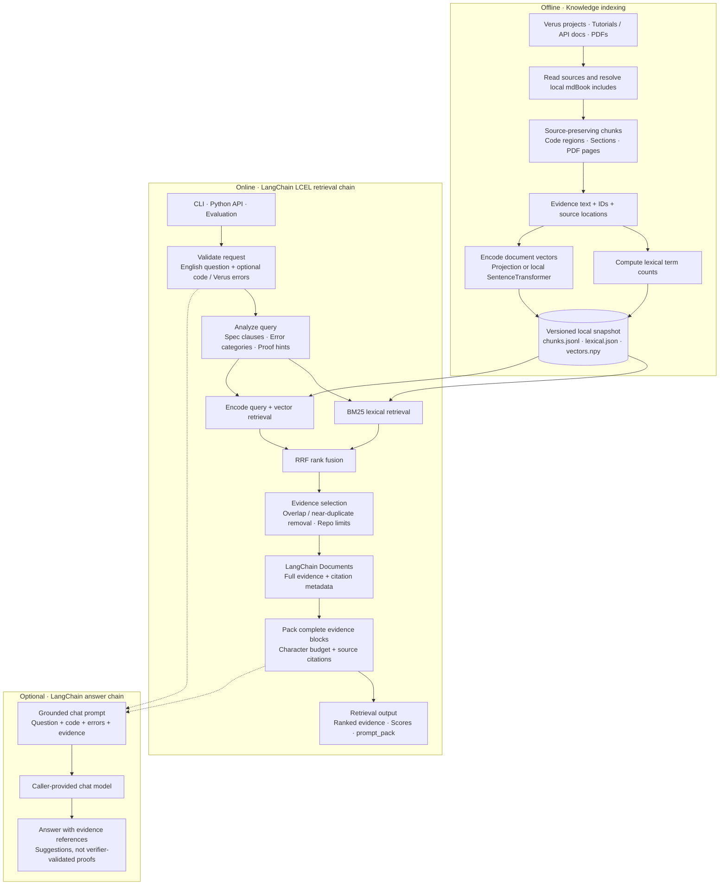

# VeRAG

VeRAG is a specialized knowledge base and local LangChain RAG system for Verus formal verification. It aggregates high-value external knowledge — official tutorial documentation, verified codebases from open-source repositories, and PDF references — and provides LLMs with precise, structured context for Verus proof debugging and specification generation.

---

## Knowledge Sources

### Core Tooling & Standard Library

| Source | Description | Link |
| --- | --- | --- |
| **Verus Core** | The primary repository for the Verus verifier and the `vstd` source code. | [verus-lang/verus](https://github.com/verus-lang/verus) |
| **VSTD API** | The official API reference for the Verus Standard Library (essential for `requires`/`ensures` contracts). | [vstd Documentation](https://verus-lang.github.io/verus/verusdoc/vstd/) |

### Documentation & Theoretical Guides

| Source | Knowledge Type | Link |
| --- | --- | --- |
| **Verus Guide** | Comprehensive tutorial covering syntax, proof techniques, and the `verus!` macro. | [Verus Guide & Reference](https://verus-lang.github.io/verus/guide/) |
| **Transition Systems** | Specialized documentation for verifying state machines and asynchronous logic. | [State Machines Guide](https://verus-lang.github.io/verus/state_machines/) |

### Verified System Projects (Golden Examples)

Production-grade verified projects providing complex, real-world proof patterns for the RAG system.

| Project | Domain | Link |
| --- | --- | --- |
| **VeriSMo** | A verified security module for confidential virtual machines. | [microsoft/verismo](https://github.com/microsoft/verismo) |
| **Anvil** | A framework for verifying Kubernetes controllers. | [anvil-verifier/anvil](https://github.com/anvil-verifier/anvil) |
| **Vest** | A high-performance verified binary parser and serializer framework. | [secure-foundations/vest](https://github.com/secure-foundations/vest) |
| **IronKV** | A formally verified, sharded key-value store. | [verus-lang/verified-ironkv](https://github.com/verus-lang/verified-ironkv) |

---

## Quick start

Python 3.10+ is required. Install the package in a virtual environment:

```sh
python -m venv .venv
source .venv/bin/activate
python -m pip install -e '.[pdf]'
verag build --repo-root . --index-dir .rag_index
verag query --index-dir .rag_index \
  --query-text "How do loop invariants establish a postcondition after a while loop?" \
  --top-k 5 --prompt-out /tmp/verus-context.txt
```

`python rag_cli.py` remains an alternative to the installed `verag` command.
Build defaults to the deterministic **projection** backend, which uses hashed
lexical/structural features, not a learned semantic model. No model download is
required. `--semantic-backend none` builds/queries a lexical-only index.

For learned embeddings, install `pip install -e '.[pdf,semantic]'`, prepare a local
SentenceTransformer model and build with `--semantic-backend sentence-transformer
--semantic-model /path/to/model`. Models are loaded with `local_files_only=True`.
At query time, `auto` uses the backend/model stored in the index. An explicit
backend mismatch fails instead of silently using a different model. If vectors
are unavailable, `auto` reports lexical fallback in `retrieval_debug`.

## Overall architecture

VeRAG builds its knowledge index offline, then uses a shared LangChain LCEL
pipeline for online retrieval. Answer generation is optional.



BM25 and vector search retrieve independently before fusion. Document vectors are
computed at build time; only the query is encoded online. The default projection
backend uses deterministic feature hashing, not a learned semantic model. A new
index snapshot becomes active only after a successful build. The optional answer
chain does not execute Verus.

## LangChain orchestration

The top-level framework is **LangChain LCEL**, supplied by `langchain-core`.
CLI, `query_index()` and evaluation all invoke the same retrieval chain shown above.

```python
from rag import create_retrieval_chain, create_answer_chain

chain = create_retrieval_chain()
state = chain.invoke({
    "index_dir": ".rag_index",
    "query_text": "How do loop invariants establish a postcondition?",
    "top_k": 5,
})
print(state["context"])
print(state["documents"][0].metadata)  # LangChain Document, with citations

# Supports invoke, ainvoke, batch and standard LangChain RunnableConfig/callbacks.
# Supply any LangChain-compatible chat model to enable generation:
# answer = create_answer_chain(chat_model).invoke({...})
# print(answer["answer"])
```

Retrieval needs no API credentials. The optional answer chain leaves provider/model
selection to the application and retains source documents alongside the answer.
It generates suggestions; it does not execute the Verus verifier. Unit tests use
a local fake chat runnable to check evidence injection without calling an API.

## Inputs and outputs

Queries accept any combination of English question, source code and Verus errors:

```sh
verag query --query-text "Why does this loop invariant fail?" \
  --code-file /path/to/example.rs --error-file /path/to/error.txt
```

```python
from rag import build_index, query_index

build_index(".", ".rag_index", include_pdfs=False, semantic_backend="projection")
result = query_index(".rag_index", "How do I prove a loop invariant?", top_k=5)
print(result["prompt_pack"])
```

Results expose full `text`, UI-only `snippet`, source lines/pages, included-code
provenance, symbol hints, lexical/semantic/RRF scores and `index_generation`.
`score` is the RRF score actually used for final ranking. `prompt_pack` preserves
full evidence blocks and formatting, up to `--max-context-chars` (default 24000);
a block that cannot fit is skipped, never truncated. This is a character budget,
not a model-token guarantee. Full evidence remains available in the JSON output.

There are no forced source quotas by default. `--min-project`, `--min-tutorial`
and `--min-pdf` opt into legacy minimum coverage. `--per-group-k` controls only
the separate `grouped` diagnostic lists, not the final result list.

## Retrieval architecture

1. **Ingest:** discover project Rust, tutorial Markdown/text and optional PDFs.
2. **Chunk:** conservatively preserve function regions, Markdown paragraphs and
   fenced code. Generic types, indentation and real document line numbers survive.
   The Rust chunker is lexical, not a complete Verus AST parser; it may include
   adjacent declarations/module braces. Unrecognized code falls back to line regions.
3. **Includes:** expand available local mdBook includes and named anchors, retaining
   referenced file/line provenance. Missing/out-of-snapshot/unsupported includes
   get an explicit unavailable marker and a manifest entry. The vendored guide
   currently references example files absent from its snapshot; these are not fetched
   or invented automatically.
4. **Index:** persist term counts and normalized document vectors in an immutable
   generation; publish `meta.json` atomically only after a successful build.
5. **Retrieve:** independently search BM25 and the stored vector corpus; combine
   candidates with RRF. Only the query is embedded at request time. Default vector
   RRF weight is 0.25 for feature hashing and 0.9 for learned embeddings; override
   with `--semantic-rrf-weight`. Projection is intentionally a weaker ranking signal.
6. **Select:** remove overlapping/near-duplicate evidence and limit project-repo
   concentration; build a context from complete evidence blocks.

Index layout:

```text
.rag_index/
  meta.json                    # active generation and embedding configuration
  generations/<generation>/
    meta.json
    chunks.jsonl
    lexical.json
    vectors.npy                # absent for lexical-only builds
```

Rebuilding creates a new generation and invalidates warm caches by snapshot path.
Failed builds leave the active generation usable. Older generations are retained;
remove them only when no readers use them. Legacy root-level `chunks.jsonl` indexes
remain readable (lexical fallback); rebuild to get structural chunks and vectors.
Builds currently scan the complete corpus; incremental updates and automatic
snapshot garbage collection are future work.

## Tests and local evaluation

```sh
python -m unittest discover -s tests -v
verag evaluate --index-dir .rag_index \
  --cases evaluation/smoke_cases.jsonl --output .rag_eval/smoke.json
```

Unit tests use a small committed corpus and no network. They cover loop-invariant
questions, error-only retrieval, overflow, quantifiers, include citations, complete
context, independent vector recall, rebuild cache invalidation and failed-build
rollback. Evaluation runs English questions against the actual local knowledge
corpus, including loop invariants and loop isolation, and exits nonzero on a missed
target document. These are development smoke checks, not a held-out accuracy claim.

## Repository layout

```text
rag/                  # installable Python library and CLI
  pipeline.py         # LangChain LCEL retrieval and optional answer chains
  chunking.py         # source-preserving lexical/Markdown chunking
  includes.py         # local mdBook include resolution
  index_builder.py    # source discovery and snapshot builds
  storage.py          # schema validation and atomic manifests
  retriever.py        # BM25, independent vector recall, RRF and selection
  semantic.py         # embedding providers
  prompting.py        # shared full-evidence context renderer
  evaluation.py       # document-target smoke evaluation
projects/             # upstream verified-project snapshots
tutorial/            # upstream tutorials/API documentation/PDFs
tests/               # isolated offline regressions and fixture corpus
evaluation/          # English full-corpus smoke questions
docs/                # architecture roadmap
.github/workflows/    # Python test matrix
```

See [CONTRIBUTING.md](CONTRIBUTING.md), [current design](rag/DESIGN.md), and the
[detailed refactor roadmap](docs/RAG_REFACTOR_PLAN.md). Third-party snapshots retain
their upstream licenses. This repository does not yet declare a root package license.

Repository publication policy: [included and excluded content](docs/REPOSITORY_CONTENTS.md).
